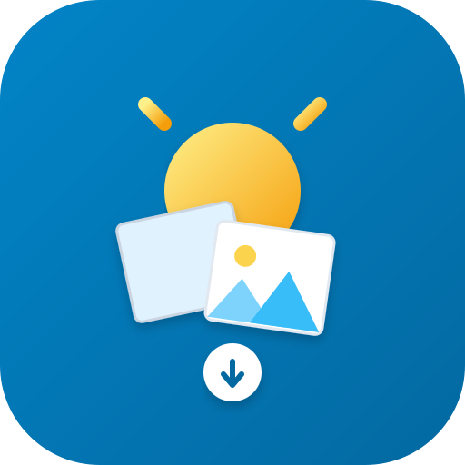

<p align="center">
  
</p>

# MyBrightDay Backup

A tool to automatically backup photos from the MyBrightDay application, with optional upload to Google Photos.

## Getting Started

### Download
Download the latest binary for your operating system from the [Releases](https://github.com/dipeshc/mybrightday-backup/releases) page.

### Running Commands

1.  **Download Photos**:
    Download photos for a specific date or range. You must provide your MyBrightDay login information.
    ```bash
    ./mbdb --mybrightday.email "user@example.com" --mybrightday.password "secret" --date=2026-06-15
    ```

    You can also specify date ranges or relative offsets:
    ```bash
    ./mbdb --date -7:0                   # Last 7 days
    ./mbdb --date 2024-01-01:2024-01-31  # Entire month
    ./mbdb                               # Defaults to today
    ```

1.  **Upload to Google Photos** (Optional):
    If you want to upload photos to Google Photos, run the initialization command once to authenticate.
    ```bash
    ./mbdb google-photos init
    ```

    Then run the download with Google Photos upload enabled.
    ```bash
    ./mbdb --googlephotos.enabled
    ```

### Automated Daily Backup (GitHub Actions)

This repository includes a GitHub Actions workflow to automatically download your photos every day and back them up directly to Google Photos, requiring no local server.

To set this up for your own account:
1.  **Fork this repository**: Click the "Fork" button at the top right of this page to create your own copy.
2.  **Get a Google Photos Refresh Token**: Run the initialization command locally to authenticate and generate a refresh token.
    ```bash
    ./mbdb google-photos init
    cat ./config/google_photos/refresh_token
    ```
3.  **Add Repository Secrets**: Go to your forked repository's **Settings** > **Secrets and variables** > **Actions** and add the following repository secrets:
    *   `MYBRIGHTDAY_EMAIL`: Your MyBrightDay login email.
    *   `MYBRIGHTDAY_PASSWORD`: Your MyBrightDay password.
    *   `GOOGLE_PHOTOS_REFRESH_TOKEN`: The content of the refresh token file generated in step 2.
4.  **Enable the Workflow**: Go to the **Actions** tab in your fork, select the "Daily Sync" workflow, and click "Enable workflow". It will now run automatically every day!
5.  **Enable the Keep Alive Workflow**: In the same **Actions** tab, also enable the "Keep Alive" workflow. It runs weekly and exists only to keep the Daily Backup from being auto-disabled by GitHub after 60 days of repository inactivity.

## Configuration Overview

Configuration can be set via CLI flags, environment variables, or a `config.yaml` file. The application follows a strict resolution hierarchy: **CLI Flags → Env Vars → Secret Files → Config File → Defaults**.

Commonly used options:
- `--date`: Date or range (e.g., `YYYY-MM-DD`, `-1`, `-7:0`).
- `--local.directory`: Where to save photos locally (default: `./photos`).
- `--googlephotos.enabled`: Enable uploading to Google Photos.
- `--dryrun`: Preview actions without downloading or uploading.

For a full list of options and details on the configuration system, see the [Configuration Reference](docs/configuration.md).

## Troubleshooting & Known Issues

* **Google Photos Unverified App Warning**: By default, the application uses an embedded Google Cloud project for OAuth. Because this project is not officially verified by Google, you will see a warning screen saying "Google hasn't verified this app" during the `google-photos init` step. You can safely click "Advanced" and "Go to MyBrightDay Backup (unsafe)" to proceed. Alternatively, you can configure your own Custom Google Cloud Project (see the [Google Photos Guide](docs/google-photos.md)).
* **Authentication Blocked by Web Session**: There is an intermittent bug where having an active login session on the MyBrightDay website can block the tool (and the daily GitHub Actions job) from authenticating. If your backup job suddenly starts failing with authentication errors, log into the MyBrightDay website in your browser, **manually log out**, and then trigger the job again.

---

## Documentation

For more detailed information, please refer to the following guides:

*   [**Configuration Reference**](docs/configuration.md): Full list of all flags, environment variables, and YAML keys.
*   [**Google Photos Integration**](docs/google-photos.md): Detailed setup guide and explanation of the deduplication strategy.
*   [**Backup Workflow**](docs/backup-workflow.md): A step-by-step look at how the application fetches and processes data.
*   [**Metadata & Image Processing**](docs/metadata-and-processing.md): Information on how EXIF data (GPS and timestamps) is generated and injected.
*   [**Architecture & Repo Structure**](docs/architecture.md): Codebase layout, storage module pattern, and the config system.
*   [**Development Guide**](docs/development.md): Instructions for building the project and contributing code.
